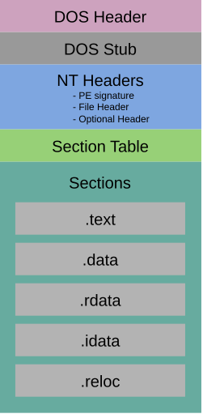

This blog is the first part of a series of blog posts about a tool I developed using the Rust programming language.

A while back, I wanted to investigate what was possible with the Rust programming language when it comes to develop **position-independent code**, aka **shellcode**. I'll first explain what a **position-independent binary** means, then show you how you can achieve shellcode using Rust. Finally, I'll present a new, innovative way to use more of the Rust programming language for your shellcode.

I just want to be clear that this blog will focus on shellcode for the Windows operating system. Shellcode for other operating systems is out of the scope of this blog.

You can find the code here: [RustyShell](https://github.com/LostAquilae/RustyShell). You can also directly import this inside your project thanks to the [rusty_shell](https://crates.io/crates/rusty_shell) crate publish on crates.io.

## What's a shellcode?

Originally, a shellcode meant an attack payload that would open up a reverse shell on a victim's computer. It had to be what is called *position-independent code*, because most of the time, it relied on code injection where your code would be directly injected in memory, without ever touching the disk.

But to really comprehend what *position-independent code* means, you have to know: None of the code you write is position-independent. When you run your binary on an operating system, several steps of loading will be executed to ensure that your binary can execute correctly. But first, let's open a simple binary to see what's inside.

### Hello world!, tell me what you are!

We'll take the simplest example possible: a *Hello World!* executable written in C:

```c
#include <stdio.h>

// This is just for the purpose of the example
int global = 0;

int main(int argc, char* argv[]) {
    // This contains a literal string: 'Hello World!\n'
    printf("Hello World!\n");

    return 0;
}
```

This code will turn into an executable with the extension *.exe* on Windows. This type of file on Windows uses the *Portable Executable* format, which is the main form of executable file on Windows.

#### PE format?

Let's start with a simple diagram that outlines the PE format:

<figure>
  
  <figcaption style="text-align: center">The PE format</figcaption>
</figure>

This is what the PE format looks like broadly. You first have different headers:

- **DOS Header**: This header comes from MS-DOS operating system, the predecessor of Windows.

- **DOS Stub**: This is a small MS-DOS executable, here for retro-compatibility. It contains a simple string that is displayed if you try to run you executable on MS-DOS. The default value is *This program cannot be run in DOS mode*.

- **NT Headers**: This is actually several headers. The important one is the Optional Header, it contains a lot of information about the executable, a lot of it useful for the loading process that we will study later.

- **Section Table**: This header lists the different sections of your executable with their size, location, etc...

Headers are mostly here for Windows to properly load the executable in memory. Then, you have the different **sections** of your binary that contains the actual payload of your executable. Let's look at the most important one, especially regarding shellcode compatibility:

- **.text**: The section that contains your executable code. All assembly instructions needed to execute your code will be stored in this section. *Memory protections: executable and readable*.

- **.rdata**: This section will contain data that only needs to be read. For example, the string *Hello World!* here is stored inside this section, because we only need to read the string, we never modify it. *Memory protections: readable*.

- **.data**: Unlike rdata, this section contains data that can be read and written to. For example, the global variable *global* in the C code will be stored in this section. *Memory protections: readable and writable*.

- **.idata**: This section is a bit peculiar. Note that you use the printf function, but it is not defined anywhere inside the code you compiled. In simple terms, you defer this work to the OS, by calling a function exported by a DLL on Windows. The printf function is actually implemented inside these files. The *.idata* section is here to store information that tell Windows *I need this function from this DLL*, and Windows will load the corresponding DLL and give you the address of the function you need inside it, basically. *Memory protections: readable*.

- **.edata**: This section is here to tell the OS where your functions are inside your binary. Most compile code does not export their functions, if this is not needed. But DLLs do, in order for you to import their function thanks to the *.idata* section. *Memory protections: readable*.

- **.reloc**: This section is an important one for our position-independent code issue. Relocations are location in your code where you rely on absolute addresses. They might need fixing, and that's the job of the OS when it is loading you. *Memory Protection: No memory protection since this is only needed for the loading process, the OS discards it when loading the executable*.

This last section needs a bit more explanation I would say: Imagine the **Hello World!** string is at offset 1000 (I will take simple addresses, that don't reflect reality at all, but help explain things clearly) in your binary. Somewhere in your code, you need to read that string, in order to send it as argument to the printf function. That's where the compiler will compute an absolute address. But the compiler cannot know the address you are going to be loaded at. Therefore, it will choose a *preferred base address*, let's say 10 000, and compute all absolute addresses from this address. The **Hello World!** string is then at address 10 000 + 1 000 = 11 000, so in your code, you will have a reference to this specific address.

The compiler also put 10 000 inside the **optional header** of your binary, in a field know as **Image Base**. Windows, when loading your binary, will try to load your code at this address first. If it succeeds, then relocations do not need to be fixed, since all absolute addresses correspond to the real address in memory where to find the data, like your **Hello World!** string. But if it can't load the binary at this address, and loads it at address 20 000 for example, then your **Hello World!** string ends up at address 20 000 + 1 000 = 21 000. As a result of this, you need to fix relocations, to make absolute addresses inside your code point to the actual location of the data in memory. Windows will then add the difference between the *preferred base address* and the actual address the binary is loaded at, to fix it. So for example, the **Hello World!** string will become: 11 000 + (20 000 - 10 000) = 11 000 + 10 000 = 21 000.

Now that you have a better grasp of the PE format, we can look at the loading process.

#### Loading process

Most of what is explained here has been partly explained when analyzing every section of the PE format. It's just to explicitly enumerate all steps done by the OS for the loading process. This will help us see clearly what we have to avoid in order to get shellcode compatible code.

- **Copy all sections**: First, the OS will copy all the sections at their respective offsets. In your RAM, there is what we call a paging system. On Windows for example, it allocates a minimum of 4 Ko at a time, which is a *page*. The sections of your binary will always be copied at the start of a page, which means you will have a certain offset between the end of the previous section and the start of a new page, where the following section will be copied.

- **Resolve all imports**: Just like we saw earlier, your binary will actually need to call functions of the OS. So the OS will read the *.idata* section to load every DLL you need and give you the address of the function you need inside these DLLs.

- **Handles every relocation**: The OS, if it couldn't load your binary at its *preferred address*, will fix every absolute addresses you use so that you don't try to write or read into non allocated memory.

So this is basically the steps that the OS provides every time you run your executable. But what happens when you can't have them? Say for process injection? When you inject yourself inside a process, the OS is not here to do all these steps for you. Then you need a code that doesn't rely on all these steps, hence, position-independent code.

### Hello World!, but shellcode

So, to get a position-independent code, now we know what we need. Let's explore each constraint to see how can we respect it.

#### Only the .text section

To avoid having to copy every section in memory, the goal is then to have only one section, the .text section containing our code. Now remember, this section is defined as *executable* and *readable*. Historically, strings were made into stack based strings so that they live only inside the .text section. But a new solution has emerged in recent years with linker script.

I believe it was [Sylvain Kerkour](https://kerkour.com/) who first presented this method in his article [How to Write and Compile a Shellcode in Rust](https://kerkour.com/shellcode-in-rust), for writing shellcode in Rust for Linux. Later on, [C5pider](https://5pider.net/) with its [Stardust](https://5pider.net/blog/2024/01/27/modern-shellcode-implant-design/) also used the same method. The goal is to merge, thanks to a linker script, the *.rdata* section, where string literals resides, into the *.text* section, where your code resides. Since *.rdata* section is read-only, it poses no problem to include it inside the *.text* section, which is *readable* and *executable*. This allows you to have literal strings inside your executable, and with PC-relative access to it, it remains fully shellcode compatible.

Apart from that, we can't have .data section, this means no global or static variable is allowed in your code.

#### No standard library

When you compile your code normally, either using C or Rust, a lot of extra code gets compiled into your binary. For example, your main function is not the real entry point of your binary. The real entry point is another function, automatically added that initialize tons of stuff before calling your own code.

This means you don't have any access to function you normally use right out of the box. We'll see how this translates in the next paragraph.

#### No imports whatsoever

Because we can't use the standard library, we rely only on WINAPI calls. But we can't just call these functions directly, otherwise it will also end up in the import table inside *.idata* section.

We need to resolve dynamically each function we want to call. We can find the addresses of DLLs inside the process thanks to the PEB structure on Windows. Then, we can read export table from *.edata* section in the DLL to find the addresses of the function we need, and then call these functions with function pointer.

#### No relocations

With the two first constraint respected, you already avoided most of the use cases that would spin up relocations in your binary.

## The position-independent template

Let's check out the template now. What do you need to use Rust and compile your code in position-independent code? A proposition was already published in Rust by [safedv](https://github.com/safedv) in [Rustic64](https://github.com/safedv/Rustic64). This template is mostly inspired by his proposition, with a few adjustments to new features of the Rust programming language.

### No main function

The first thing is to remove the main function and the use of the standard library. We can do this in Rust with these two lines:

```rust
#![no_std]
#![no_main]
```

The first tells the language we won't use the standard library. Therefore, we cannot import anything from std library. The second tells the language we don't have a main function per se. Of course, we will have an entry point, but it won't be called *main*.

The entry point looks like this:

```rust
#[unsafe(no_mangle)]
#[unsafe(link_section = ".text.entry")]
pub fn align_stack() -> i32 {
    unsafe {
        asm!(
            "push rsi",
            "mov rsi, rsp",
            "and rsp, 0x0FFFFFFFFFFFFFFF0",
            "sub rsp, 0x020",
            "call ExecutePayload",
            "mov rsp, rsi",
            "pop rsi"
        );
    }
    0
}
```

There is a lot to say here.

#### #[unsafe(no_mangle)]

This line tells the compiler to not mangle the function name. Name mangling is a concept used in some programming languages. It does not exist in C for example, that's why you can't have two functions that have the same name. But in C++ or Rust, you can name two functions the same way, on two different classes or structures. The name mangling will *mangle* names to integrate the class or structure name inside the symbol name for the linker, to dissociate the function that have the same name.

But for our template, we need to tell the linker which function name to use for the entry point, therefore, we have to disable name mangling to ensure the function name will stay *align_stack* for the linker.

#### #[unsafe(link_section = ".text.entry")]

This attribute tells the compiler to put this function into its own section, separated from all the code. When executing the shellcode in memory, we will just copy the content of the *.text* section and begin execution at the start of this section. Unfortunately, the Rust compiler might just choose to put the entry point in the middle of the *.text* section, which would break execution at its very beginning.

Later, in the linker script that we will also check out, we'll tell the linker to put this section first in the final *.text* section of the binary to ensure this function we'll be the starting bytes of the final *.text* section.

#### Inline asm

Then we use the **asm!** macro to inline a small asm procedure inside the function. This procedure was originally proposed by [@mattitestation](https://mattifestation.medium.com/) in his [PIC_Bindshell](https://github.com/mattifestation/PIC_Bindshell/blob/master/PIC_Bindshell/AdjustStack.asm) project. It just here to align the stack to a 16 bytes alignment. This is needed for x64 code on Windows because the OS assumes that the stack is 16 bytes aligned, and some WINAPI function might use XMM register, which needs the stack to be 16 bytes aligned. Without this small procedure, execution might crash upon calling such WINAPI function.

After aligning the stack, this entry point calls into a function I called *ExecutePayload*, which is the *real* entry point of the code, where the user's code will start.

### Dynamic resolution of WINAPI function

Like I said earlier, you cannot have any import inside your binary. So when you want to call a function, you have to get its address at runtime and call it thanks to a function pointer.

This is done through two functions: **get_module_address** and **get_exported_symbol**.

The first function, **get_module_address**, will try to retrieve the address of a DLL inside the RAM. On Windows, every process as its own virtual *RAM*. **DLLs** are loaded inside that virtual memory. The *Process Environment Block (PEB)* is a structure, available inside that virtual memory as well, that holds lots of information about the current process and notably a doubly linked-list of structures representing each DLL loaded inside the process.

In x64 Windows, the *gs* register holds a pointer toward the *Thread Environment Block (TEB)*, which is the same thing as **PEB** but for one thread specifically. At offset **0x60** of this **TEB**, there is a pointer towards the **PEB**. Then, it is simply about looping through the linked list until you find the DLL you want. In each structure representing a DLL, you have its name and its address inside the process, everything you need to find every DLL you might need.

If you can't find the DLL you're looking for, it means it is not loaded inside the process. You can specifically require its loading thanks to LoadLibrary function.

Then, **get_exported_symbol** simply reads through the **export table** of the DLL. The **PE** format tells you where this table is located. You just have to loop through it, find the function you seek, and get its address in this export table.

So, when you want to call a function, you first need to retrieve the DLL's address that contains your function, then find the function you're looking for in the export table of this DLL to find its address.

All the code for this can be found here: [runtime_resolve.rs](https://github.com/LostAquilae/RustyShell/blob/main/crates/RustyShell/src/runtime_resolve.rs).

### Global Allocator

When I said you couldn't use any code from standard libraries, I lied. In Rust, the standard library is actually composed of the core library and the alloc library plus several modules unique to the std. The core library you can use right out of the box for shellcode compatibility, but the alloc crate is where structures allocated on the heap reside. And it needs a way to allocate on the heap.

Normally, this should be done with the std crate, but as we can't use it for our use case, we need to redefine it. Since Rust comes with great modularity, we can redefine the global allocator that will be used for every heap-allocated structure inside the alloc crate, and we can make it shellcode compatible. Therefore, we can use things like Vec, String, etc... Inside our position-independent code.

All the code can be found here: [allocator.rs](https://github.com/LostAquilae/RustyShell/blob/main/crates/RustyShell/src/allocator.rs). We simply use the *get_module_address* and *get_exported_symbol* function to dynamically call into **HeapAlloc**, **HeapFree** and **HeapReAlloc**.

### Compilation flags

For this template to compile as position-independent code, we also need to pass some specific compilation flag. Important to note that you need Rust nightly to compile properly this template, since it relies on features and compilation flags that are only available on nightly. Let's understand each of these flags.

- **-Z unstable-options**: This flag is to enable unstable flags that exist in the Rust compiler. It simply allows us to use other flags.

- **-C panic=immediate-abort**: This is actually a new panic method, where you can simply say you want to interrupt execution upon panicking. Before, you had to propose your own function to define the panicking behavior. With this flag, you don't have to anymore if you just want to abort execution.

- **-C link-arg=-nostdlib**: This flag tells the linker to not include any standard library. Like we said before, when compiling your program, a lot of code you didn't write gets included in the final binary, serving several purposes. But we don't want any of this for shellcode compatibility, so we ask the linker to not include any of this.

- **-C codegen-units=512**: This flag is a bit more complicated. When your code is transformed by the compiler, it will be transformed into object files. This flag controls how many *units* the code will be split into. For example, when compiling the core library, setting this to 1 will make one big object file with everything from the core library in it. Depending on this static library means that all the code from the core library will end up in your binary. Putting a great number, like 512, means splitting the core library into 512 different *units*, meaning you will end up with 512 object files. Depending on this library, the linker will only include the object files containing the symbols you really need. So why do we put a great number here? Because it allows us to have a small binary in the end. The more *units* you have, the more fine-grained control the linker have to only include what is of interest to you, reducing the size of your binary. When we are talking about payloads, we want them as small as possible. For this template, we are recompiling the core, alloc, and compiler_builtins crate. We put 512 to have the maximum codegen *units* on each of these crates. This depends on the crate size, a crate has a maximum number of splitting it can take.

- **-C link-arg=-Wl,-T./Linker.ld**: This flag just tells the Rust compiler to include a linker script at the linking stage. We are using the target triple *x86_64-pc-windows-gnu*, which relies on mingw for linking. We will take a look at the linker script later in this blog.

- **-C strip=symbols**: This is equivalent to -s for the gnu linker *ld*. It tells the linker to remove debugging info and the symbol table from the executable. These are not needed for correct execution of the binary, it's just metadata we can remove.

- **-C lto=yes**: This enables *link time optimization*. You might think this is about the mingw linker, but it is actually for LLVM. LLVM is a compiler backend for many languages. It provides an *intermediate language* frontend compiler will turn your code into. Then, LLVM takes care of optimizations on this intermediate representation. This flag tells LLVM to enable lto for your build. If you want to learn more about lto: [Link-time optimization (LTO)](https://convolv.es/guides/lto/). For now, you just need to understand that it allows us to better optimize the binary in terms of size and execution speed.

- **-C embed-bitcode=yes**: It tells the rust compiler to embedded LLVM bitcode inside the object files. It is needed for **fat lto**, which is enabled with the previous flag.

- **-C opt-level=s**: This flag controls the optimization to be used. -s value specifically enable optimizations for binary size.

- **-Z build-std=core,alloc,compiler_builtins**: This flag tells the compiler to rebuild the core, alloc and compiler_builtins crate. This is needed, since we enabled the panic immediate-abort panicking behavior, which is not the already precompiled behavior standards crate are shipped with, hence, the need to recompile them.

- **-Z build-std-features=compiler-builtins-mem**: This allows the compiler_builtins crate to propose standard builtins memory function, so that we don't have to redefine them. [Rustic64](https://github.com/safedv/Rustic64) for example, has to define these function [here](https://github.com/safedv/Rustic64/blob/master/src/nocrt.rs). They are needed for all kind of things, and your linker might tell you it misses a definition for it. When working with C style null terminated string, your rust code might try to call strlen for example, and you would have to define it yourself, since we ask for no std lib. But enabling this flag allows the compiler_builtins crate to propose out of the box an implementation for these kinds of functions, so you don't have to write your own implementation.

These are all the compiler flags we need to get a position-independent executable. All these compilation flag documentation is available [here](https://doc.rust-lang.org/rustc/codegen-options/index.html), if you want to go deeper into it.

### Linker Script

As we have seen earlier, we pass a linker script to the linker. Here it is:

```ld
/* Simple ENTRY statement to put the entry point toward the align_stack routine */
ENTRY(align_stack);

SECTIONS
{
    /* Grouping code and read only data, starting with .text.entry which contains the small align_stack procedure, which is the real entry point of the shellcode */
    .text  __image_base__ + ( __section_alignment__ < 0x1000 ? . : __section_alignment__ ) :
    {
        *(.text.entry)
        *(.text)
        *(.rdata*)
    }

    /* Discarding the pdata and xdata sections, which are not needed in the final binary */
    /DISCARD/ :
    {
        *(.pdata)
        *(.xdata)
    }
}
```

The first line **ENTRY(align_stack)** is here to define the function named align_stack to be the entry point of the binary. This is why we had to disable name mangling on the function, so that the linker can find it later with this directive.

Then, we define the .text section in the final binary to be:

- **\*(.text.entry)**: First, the section containing only the align_stack function. This is here to ensure the first bytes of the .text section are in fact the align_stack function, to make sure the entry point is at the start of the section, because when injecting the shellcode, execution will start at the beginning of the binary.

- **\*(.text)**: Then, simply the rest of the code.

- **\*(.rdata\*)**: Finally, we put the read only section which contains our read only data. This won't generate relocations since the code and the rdata will be in the same section, the code will use relative addresses to interact with the read only data.

To finish, we just discard sections that are not essential, here **.pdata** and **.xdata**, which contains metadata about exceptions, to correctly handle errors for every function of your code. Since we want panic immediate abort behavior anyway to leave the least traces possible, we don't really need these sections.

## Conclusion

So this here is everything we need to make a position-independent Rust code. This template is not really new, as we have seen that [Rustic64](https://github.com/safedv/Rustic64) already proposes the same features. There are minor improvement to what [safedv](https://github.com/safedv) did like the panic immediate abort behavior or the standard function directly proposed by the compiler_builtins crate. In the two blog posts that will follow, we will focus on what RustyShell really brings to the table.

## Credits

[How to Write and Compile a Shellcode in Rust](https://kerkour.com/shellcode-in-rust) by [Sylvain Kerkour](https://kerkour.com/)

[Stardust](https://github.com/Cracked5pider/Stardust) by [C5pider](https://5pider.net/)

[Rustic64](https://github.com/safedv/Rustic64/tree/master) by [safedv](https://github.com/safedv)

[PIC_Bindshell](https://github.com/mattifestation/PIC_Bindshell/blob/master/PIC_Bindshell/AdjustStack.asm) by [@mattitestation](https://mattifestation.medium.com/)

## Sources

[Link-time optimization (LTO)](https://convolv.es/guides/lto/)

[Rust Codegen Options](https://doc.rust-lang.org/rustc/codegen-options/index.html)