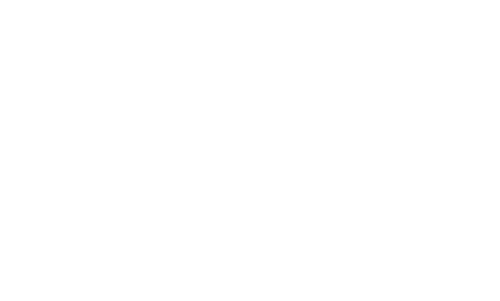

As I said in the previous blog posts, trait object are going to be a problem. But first, we have to understand what they are.

## Generics and Trait Objects

Rust has some features for generic types. Generic allows you to write one piece of code, and use it with different types and structures. But we have to differentiate between static generic behavior and dynamic generic behavior.

### Static generic behavior

Let's take the example of the Rust book for [generic behavior](https://doc.rust-lang.org/book/ch10-01-syntax.html):

```rust
fn largest<T: std::cmp::PartialOrd>(list: &[T]) -> &T {
    let mut largest = &list[0];

    for item in list {
        if item > largest {
            largest = item;
        }
    }

    largest
}

fn main() {
    let number_list = vec![34, 50, 25, 100, 65];

    let result = largest(&number_list);
    println!("The largest number is {result}");

    let char_list = vec!['y', 'm', 'a', 'q'];

    let result = largest(&char_list);
    println!("The largest char is {result}");
}
```

Here, we can see the **largest** function is generic over some type T, which have to implement the [std::cmp::PartialOrd](https://doc.rust-lang.org/std/cmp/trait.PartialOrd.html) trait. This trait allows you to redefine the **>** operator so that it calls the **gt** function of the trait. So the type you will use the largest function with have to implement this trait, otherwise you will face a compiler error, telling you it doesn't.

But that's not the point. What's interesting to understand here is that we face static generic behavior. This means that when, in the main function, we use the largest function with i32 and then with chars, there is actually two different functions that end up in your binary. One for i32 and one for chars, and call to the largest function is replaced to a call to the right function with the right arguments. Basically, this means that your code would now looks like this:

```rust
fn largest_i32(list: &[i32]) -> &i32 {
    let mut largest = &list[0];

    for item in list {
        if item > largest {
            largest = item;
        }
    }

    largest
}

fn largest_char(list: &[char]) -> &char {
    let mut largest = &list[0];

    for item in list {
        if item > largest {
            largest = item;
        }
    }

    largest
}

fn main() {
    let number_list = vec![34, 50, 25, 100, 65];

    let result = largest_i32(&number_list);
    println!("The largest number is {result}");

    let char_list = vec!['y', 'm', 'a', 'q'];

    let result = largest_char(&char_list);
    println!("The largest char is {result}");
}
```

So, as you can see, after the compiler analyses your code, no generic behavior is being executed at runtime, everything is handled at compile time for you. This kind of generic behavior is not a problem for shellcode compatibility, since the above code would be totally fine inside our shellcode template. Problem arises from dynamic generic behavior.

### Dynamic generic behavior or trait object

Now what happens when using trait objects. Trait objects are another kind of generic behavior that resolves at runtime. Instead of creating as much instances as needed for a specific code that uses generic, that specific code actually handles every case possible in the same function, at runtime. This is called dynamic dispatch.

It's the same concept with virtual method in C++. When having parent and child classes having their own implementation of a virtual function, when you hold a reference or a pointer to the Base class, but that could actually be a pointer to the base or child class, then the call to the virtual function goes through what is called a vtable to call the right function on the actual object we are holding a pointer to. For those who know about this behavior in C++, trait objects are exactly the same. But for those who don't, let's take an example in Rust:

```rust
trait SharedBehavior {
    fn name(&self) -> &str;
}

struct Struct1 {
    name: String,
}

impl SharedBehavior for Struct1 {
    fn name(&self) -> &str {
        &self.name
    }
}

struct Struct2 {
    name: String,
}

impl SharedBehavior for Struct2 {
    fn name(&self) -> &str {
        &self.name
    }
}

fn print_name(structure: &dyn SharedBehavior) {
    println!("Name: {}", structure.name());
}

fn main() {
    let struct1 = Struct1 { name: String::from("Struct1") };
    let struct2 = Struct2 { name: String::from("Struct2") };

    print_name(&struct1);
    print_name(&struct2);
}
```

Okay, so we have a trait called **SharedBehavior** and two structures, **Struct1** and **Struct2**, that just have a name field that represents the structure's name and that implements the SharedBehavior trait. Then, we have a function **print_name**, that takes a **&dyn SharedBehavior**. This is where all the magic happens. Remember what we said earlier, if we had put this code:

```rust
fn print_name(structure: &impl SharedBehavior) {
    println!("Name: {}", structure.name());
}
```

The **&impl SharedBehavior** is just syntactic sugar to no have to declare specifically a generic type T, but it does exactly the same as declaring the T generic type and defining it like the first example of this post. So with this code, we would of end up with two different functions, one that takes a **Struct1** and one that takes a **Struct2**. But here, we used the **dyn** keyword, which specifically says we want dynamic dispatch, meaning we only have one function that takes care of resolving the right name function according to the actual object passed to it as argument. But how does it do that? Thanks to virtual tables.

## Virtual Tables

A virtual table is a table holding pointers to the implementation of functions. For example here, we specifically asked for dynamic dispatch over the **SharedBehavior** trait. So the **print_name** function will receive a specific value as argument.

Normally, a function that takes a structure as argument receives a reference to this structure directly, so that it can work on it. But the **print_name** function does not take a structure directly as argument, it takes what we call a **trait object**, here meaning any object that actually implements this trait. So what does it receives? It receives what we call a **fat pointer**. A **fat pointer** in Rust, is a structure holding two pointers. One that points to the object itself and the other that points to the virtual table of some trait that this object implements, here **SharedBehavior**. Here is a drawing which will help understand:

<figure>
  
  <figcaption style="text-align: center">Fat pointers vtables explanation</figcaption>
</figure>

Note how the vtable is constructed, it will be useful later:

- **Drop function**: The first field is a pointer toward the drop function for this structure. Sometimes, on certain object, you will have a specific drop function that will correctly free the memory used by the object. This function may not exists, and if that's the case, this pointer will be null

- **Size**: This field represents the size in memory that the object takes. It might be needed for example by the drop function to properly deallocate the right amount of memory when destroying the object

- **Alignment**: This field represents the alignment in memory of the object. Also needed by operations dealing on memory (allocation, deallocation, ...)

Note that every field are 8 byte long. 

After that, you have pointers to the functions of the trait this vtable refers to. So, our **print_name** function will actually do the following to call the right **name** function: Get the second pointer of the fat pointer and follow it. Offset this pointer by the number of bytes necessary to hit the pointer to the name function inside the vtable. Get the function pointer and call it to call the right **name** function. The offset is actually decided by the compiler: It decides that the name function will be at offset 24, the first function pointer after the alignment field. Then for each call to the **name** function on a **trait object** for **SharedBehavior**, it knows it has to offset inside the vtable by 24.

What you need to understand is that one vtable will be generated per structure implementing the SharedBehavior trait. So here, you will have one vtable for Struct1 structure and one vtable for Struct2 structure, each one with different pointers and values for each of its field. But every Struct1 object will share the same vtable though, because they all need the exact same values since the drop function, the size, the alignment and the name function pointer will all be the same for every object of the Struct1 structure.

Okay so now you understand how **VTables** work. You might see where the problem is then. Vtables holds pointer i.e. absolute addresses towards functions... It generates relocations of course! That's our problem. Remember what we said about relocations, if we have an absolute address inside our binary, it will be calculated from the preferred loaded address put by the compiler. But if the OS can't load our binary to this address, then every absolute addresses becomes obsolete and needs to be fix. Therefore, it breaks shellcode, because we can't know in advance where we are going to be loaded.

And the problem is: the core and alloc libraries may use sometimes, on certain structures, trait objects, which will resolve into vtables. The closest example of this is the [format!](https://doc.rust-lang.org/alloc/macro.format.html) macro. At some point, it uses a trait object on the [Write](https://doc.rust-lang.org/alloc/fmt/trait.Write.html) Trait. And it's quite bothering, because it would mean that not all of the core and alloc libraries can be used. We would have to test every import inside these crates and verify it doesn't generate vtables.

But, I saw on the clang compiler for C++, a flag that might be interesting: **-fexperimental-relative-c++-abi-vtables**. It specifically tell the compiler to generate vtables with relative offset to function instead of absolute pointers. This might be exactly what we need.

Okay, so relative vtables do exists... but only in C++, with an experimental flag of the Clang compiler frontend. Clang uses LLVM as backend for the code generation part. Turns out, Rust also uses LLVM as part of its backend. I tried to see if there was any way to enable the same behavior, at the LLVM level though. I didn't find any. However, LLVM allows you to write scripts for optimizations. The solution might resides in these scripts But first, what is LLVM really?

## LLVM

When it comes to compiler, there are different parts of it. Usually you have what we call a frontend and a backend. The frontend takes care of parsing your code and turn it into a *intermediate representation*. The backend actually turns this *intermediate representation* into assembly that targets a specific **processor architecture**: x86, ARM, ect...

For example, Clang is the C++ frontend that uses LLVM as a backend. LLVM provides what is called **LLVM IR**, LLVM's own Intermediate representation. It is a language that sits between your code and assembly. It is hardware agnostic, and also language agnostic. So Clang turn C++ code into this LLVM IR, and then uses LLVM to optimize the IR and turn it into binary code for a specific **processor architecture**. Sadly, the special flag for relative vtables in C++ only works at the frontend level, not on LLVM.

The Rust compiler roughly work the same way. It's only a frontend that turn your Rust code into LLVM IR and then uses LLVM as the backend. LLVM performs optimizations at this stage. This allows to benefits from the same optimizations, whatever languages you use or processor architecture you target. It gives you consistency across each of your projects and targets. Of course, you cna also have optimizations at the assembly level later on.

Let's take a look at the LLVM IR now.

### LLVM IR

LLVM IR is a [Static Single Assignment](https://en.wikipedia.org/wiki/Static_single-assignment_form) language, meaning each variable is assigned exactly once. Let's take a rust code for example and see its corresponding IR:

```rust
fn add(i: i32, j: i32) -> i32 {
    i + j
}
```

```llvm
; Test_Rust::add
; Function Attrs: nonlazybind uwtable
define internal i32 @_RNvCsivtQJMP6Nh_9Test_Rust3add(i32 %i, i32 %j) unnamed_addr #0 !dbg !147 !guid !155 {
start:
  %j.dbg.spill = alloca [4 x i8], align 4
  %i.dbg.spill = alloca [4 x i8], align 4
  store i32 %i, ptr %i.dbg.spill, align 4
  store i32 %j, ptr %j.dbg.spill, align 4
  %0 = call { i32, i1 } @llvm.sadd.with.overflow.i32(i32 %i, i32 %j), !dbg !158
  %_3.0 = extractvalue { i32, i1 } %0, 0, !dbg !158
  %_3.1 = extractvalue { i32, i1 } %0, 1, !dbg !158
  br i1 %_3.1, label %panic, label %bb1, !dbg !158

bb1:                                              ; preds = %start
  ret i32 %_3.0, !dbg !159

panic:                                            ; preds = %start
; call core::panicking::panic_const::panic_const_add_overflow
  call void @_RNvNtNtCsj07cU7DEYcL_4core9panicking11panic_const24panic_const_add_overflow(ptr align 8 @alloc_f50689592e4950fb14ebe24334607aab) #9, !dbg !158
  unreachable, !dbg !158
}
```

Okay, so we have a simple *add* function that justs adds two number and return the result. First, you can see the function's identifier, where the name *add* that we put ends up at the end of the string name. Then you have both parameters, preceded with their type: **i32 %i, i32 %j**. let's see how this function turned out in term of IR.

First, you have two new variables: **%j.dbg.spill** and **%i.dbg.spill**. I call these variables, but LLVM refers to them as registers. It's like a register in assembly, except you can have and infinite number of them, they are like *virtual registers*. Let's just call them variables. So they are both produced with **alloca**, which is a small procedure to allocate on the stack. They allocate **[4 x i8]** meaning 4 bytes each, which is logic since parameters are i32, and their alignment is 4.

Then, the store operation is used, to store the value of **%i** and **%j** into their corresponding newly created variable.

After that, you have a call instruction, which calls the **@llvm.sadd.with.overflow.i32** procedure. We can see that it returns **{ i32, i1 }**, meaning it returns a **i32** and a **i1**. Type in LLVM can have any number of bits you want. In Rust, you would have for example i8, i16, i32 and i64. In LLVM, you can have i1 but also i12 or i23, it doesn't matter. So this procedure returns the result as the first return value, and then it returns a boolean essentially, since it's only one bit. This boolean indicates if the add provoked an overflow or not.

Since **%0** now holds a tuple, you need to extract every value to work with them. This is why you have two **extractvalue** instructions, one for extracting the result and the other for extracting the overflow flag.

Then, you have a **br** instruction, which is a branch instruction. It checks if an overflow happened, and if that's the case, jumps directly to a branch where your rust code panics. But if no overflow happened, then it returns the result thanks to the ret instruction.

So as you can see, LLVM IR is a language that sits between your code and the final assembly code. This is where lots of optimizations are going to take place, done by LLVM. But you have to understand that the final backend will also do optimizations. For example, here we allocate on the stack to store the values, but in the final assembly, for such a short code, everything could happen inside registers, without ever allocating in the stack.

If you want more information on LLVM or LLVM IR, here are some resources: [LLVM Tutorial](https://www.compilersutra.com/docs/llvm/), [A gentle introduction to LLVM IR](https://mcyoung.xyz/2023/08/01/llvm-ir/), [LLVM Project](https://llvm.org/docs/).

## How calls work in modern operating system, at the assembly level

Before diving into how vtables calls work in LLVM IR, we first need to understand how calls actually work at the assembly level for modern operating systems. 

So calls can either be:

- **Direct**: This means the address is hardcoded inside the call instruction. You call this function, the compiler resolve the address of the call and directly embed it inside the call instruction. You will always call the same location with a direct call.

- **Indirect**: Here, the address is retrieved from somewhere, either a memory location or a register for example. Function pointers in C or virtual function table in C++ should behave like this in assembly (minus compiler optimizations). Several execution of this instruction might end up calling different locations, depending on your code behavior. For example, if I define a C function that takes a function pointer as argument and call this function pointer, then the resulting assembly for this function will have a call instruction like this: **call reg**. And the value inside the register will change depending on which function pointer I pass as argument when I call the function. What I want you to understand here is that the same call instruction could resolve into different calls locations.

But calls can also either be:

- **Absolute**: The call operand is the absolute, non-relative address toward the memory where the function resides.

- **Relative**: This is not an address, but rather on offset to the function from the current instruction pointer, pointing at the call instruction (RIP register).

Let's take some examples to really understand how every function call resolves in assembly:
```c
int test(int i) {
    return i + 10;
}

int main(int argc, char* argv[]) {
    int i = 10;
    int j = test(i);

    return 0;
}
```

The call to the test function will be of the form: **call rip+offset**. Because it is a **direct call** inside your own code, so the compiler can, at compile time, calculate the offset directly and do a **RIP relative call**.

But if you do this:

```c
#include <stdio.h>

int test(int i) {
    return i + 10;
}

int main(int argc, char* argv[]) {
    int i = 10;
    int j = test(i);
    
    printf("The value of j is: %d\n", j);

    return 0;
}
```

Then, the call to the **printf** function will also be a **direct call**, but it will be an absolute direct call, because the printf function is not inside your code. When loading your executable, the operating system will give you the absolute address to the printf function, and will insert it inside the call instruction.

So that was the two possibilities for **direct calls**, what about Indirect calls:

```c
#include <stdio.h>

int test(int i) {
    return i + 10;
}

int main(int argc, char* argv[]) {
    // Getting a function pointer to the test function
    int (*test_pointer)(int) = test;
    int i = 10;

    // Calling the pointer to the test function
    int j = test_pointer(i);
    
    printf("The value of j is: %d\n", j);

    return 0;
}
```

The call to test_pointer is actually a call to a function pointer on the test function. This means the call will resolve into a call instruction of the form: **call reg** or **call mem_location**, mem_location being somewhere on the stack or the heap or any other memory location. The pointer will have an absolute address to the function. Indirect calls cannot be made relative, they are always made on absolute addresses.

So as we saw, a call can either be **direct and relative** or **direct and absolute** or **indirect and absolute**. Vtables are just function pointers inside a structure that resides in your own binary. Some memory jumps and structure parsing is needed, but in the end, it's just an **indirect and absolute** call.


## Making VTables relative

I first started to imagine a solution at the assembly level. But that was not the right solution for several reasons:

- **No API to edit assembly code**: Compared to LLVM IR, which has LLVM passes that you can custom write, assembly patching would have been done relying only on string matching and weird tricks to make it work. LLVM passes seemed a lot better for this use case.

- **A lot harder to fix**: At the assembly level, we work on a lower level than LLVM IR. The fix would have taken a lot of assembly instructions to work properly. Plus, vtables pointers couldn't have been made relative in assembly, so a calculation and a fix would have been only possible at the binary level, which increase complexity of a stable, reliable fix.

- **Only working for x86**: Working on the assembly level provides a solution for only x86 code, not ARM or other processor architecture. Working on the LLVM IR directly, you can then compile for every processor architecture that LLVM supports

For all these reasons, I started to look at how VTables calls are managed in LLVM IR.

### VTables in LLVM IR

#### Vtables definition

First, let's take a look at the vtable definition in LLVM IR:

```llvm
@vtable.0 = private unnamed_addr constant <{ [24 x i8], ptr }> <{ [24 x i8] c"\00\00\00\00\00\00\00\00\10\00\00\00\00\00\00\00\08\00\00\00\00\00\00\00", ptr @_RNvXs1g_NtCshoIjhMyZzUf_4core3fmtReNtB6_5Debug3fmtB8_ }>, align 8
@vtable.1 = private unnamed_addr constant <{ ptr, [16 x i8], ptr, ptr, ptr }> <{ ptr @_RINvNtCshoIjhMyZzUf_4core3ptr9drop_glueNtNtCshodfiC9HsYt_5alloc6string6StringEBF_, [16 x i8] c"\18\00\00\00\00\00\00\00\08\00\00\00\00\00\00\00", ptr @_RNvXsZ_NtCshodfiC9HsYt_5alloc6stringNtB5_6StringNtNtCshoIjhMyZzUf_4core3fmt5Write9write_str, ptr @_RNvXsZ_NtCshodfiC9HsYt_5alloc6stringNtB5_6StringNtNtCshoIjhMyZzUf_4core3fmt5Write10write_char, ptr @_RNvYNtNtCshodfiC9HsYt_5alloc6string6StringNtNtCshoIjhMyZzUf_4core3fmt5Write9write_fmtB6_ }>, align 8
```

Here we have two vtables definition. The first one, we can see the **drop** function is zeroed out, meaning the trait object doesn't have one. The size is **0x10** and the alignment is **0x8**. Then you have a ptr to ****@_RNvXs1g_NtCshoIjhMyZzUf_4core3fmtReNtB6_5Debug3fmtB8_** function. We can see that there is also the types definition at the beginning of the line. The ptr keyword type for the function tells us it's going to be an absolute address toward the function.

#### Vtables calls

To better understand how vtables calls are made, let's first look at a *normal* call instruction:

```llvm
  call fastcc void @_RNvNtCs7UalrjukX49_20RustyShell_shellcode15runtime_resolve18get_module_address(ptr noalias nofree noundef nonnull align 8 captures(none) dereferenceable(24) %_1, ptr noalias nofree noundef nonnull readonly captures(address, read_provenance) @alloc_51761afdde5661790743ff42719270e3.5, i64 noundef 12) #21
```

This is a call instruction to call into the get_module_address method of the [runtime_resolve.rs](https://github.com/LostAquilae/RustyShell/blob/main/src/runtime_resolve.rs) module. We can see here that the call operand, i.e. the value that we actually call is a function definition: **@_RNvNtCs7UalrjukX49_20RustyShell_shellcode15runtime_resolve18get_module_address**. We can find this function definition somewhere in the same file:

```llvm
; RustyShell_shellcode::runtime_resolve::get_module_address
; Function Attrs: nounwind optsize uwtable
define internal fastcc void @_RNvNtCs7UalrjukX49_20RustyShell_shellcode15runtime_resolve18get_module_address(ptr dead_on_unwind noalias nofree noundef nonnull writable writeonly align 8 captures(none) dereferenceable(24) %_0, ptr noalias nofree noundef nonnull readonly captures(address, read_provenance) %module_name.0, i64 noundef %module_name.1) unnamed_addr #0 {
start:
  %self_iter.i = alloca [24 x i8], align 8
  %_4.i = alloca [24 x i8], align 8
```

I've put only the first instruction of the function, because what I wanted to show you is that you have here the **define internal fastcc void @_RNvNtCs7UalrjukX49_20RustyShell_shellcode15runtime_resolve18get_module_address** function definition, which is the exact same name than the one in the call instruction.

This kind of call is a **direct call**, wether it be inside your own code **(relative)** or not **(absolute)**. They will never be absolute in our shellcode template, because we make sure that we don't call functions outside of our code, at least not statically.

Now let's take an example of indirect function call:

```llvm
  %f.i.i = tail call noundef nonnull align 8 ptr @_RNvNtNtNtCshoIjhMyZzUf_4core2io5error12os_functions16get_os_functions() #9, !noalias !369
  %_4.i.i = load ptr, ptr %f.i.i, align 8, !noalias !369, !nonnull !4, !noundef !4
  %_0.i.i = tail call noundef zeroext i1 %_4.i.i(i32 noundef %_3.i, ptr noalias nofree noundef nonnull align 8 dereferenceable(24) %f) #9, !noalias !363
```

Here we first have a **call** to **get_os_functions**, which is a function inside the core library, that returns a pointer to a structure holding function pointers. Then, the **load ptr** is here to dereference the pointer returned by **get_os_function** and take the pointer that is at this address, which is a **function pointer**. Finally, you have a call to this **function pointer**.

Remember what I said earlier, **indirect calls** like this are always **absolute**, and that's true. The call instruction will end up calling a pointer to an **absolute address** toward an os function (os function here being a function inside the core library. It's just how it has been named inside the core library, it's not actually a WINAPI function or any other system call on other OS). And yet, this works inside our shellcode. But why? It's an absolute address, it should involve relocations and break shellcode!

Well the magic happens at the moment where the **function pointer** is initialized. The structure returned by the **get_os_function** is initialized at some point. It is not statically initialized at compile time. The pointers to the *os functions* is retrieved at runtime. And when they are initialized, it can be done **relatively**. Just like a **direct call** inside you own code, the compiler can calculates the offset between your **function pointer** initialization and the actual **function location**. So the resulting instruction in assembly will be in the form: **mov reg, rip+offset**, where *reg* end up inside your function pointer to initialize it properly.

Therefore, function pointers inside our code is not a problem, because they are also initialized relatively, as long as they are not declared as a global or static variable. Awesome!

Okay, but what about **VTables calls** then? That's a problem because function pointers inside vtables are actually statically initialized. Inside the .rdata section of the binary, you will find the vtable, with the function pointers calculated based on the preferred base address of the binary. Therefore, it will generate **relocations**. Let's see first how vtables calls are emitted with **LLVM IR**:

```llvm
  %4 = getelementptr inbounds nuw i8, ptr %f.8.val, i64 32
  %5 = load ptr, ptr %4, align 8, !invariant.load !5, !nonnull !5
  %_7 = tail call noundef zeroext i1 %5(ptr noundef nonnull %f.0.val, i32 noundef %0) #23
```

So here we have pretty much the same instruction than the example on **get_os_functions**. You have **%f.8.val**, which is the pointer toward the **vtable**. Then, the **getelementptr** offsets this pointer by 32 bytes, to get into the second function pointer after the **drop**, **size** and **align** fields. The **load ptr** is here to dereference the pointer to get the actual function pointer and then the **call instruction** calls it.

The first question I asked myself was: This looks a lot like when calling a function pointer. How can I differentiate the two? Because in the function pointer example, it is obvious that it comes from a function, and not a vtable. But on the vtable example, the **%f.8.val** could actually be the return value of the get_os_function, that was called earlier. How can I be sure we are talking about a vtable here?

Well the answer lies in the details. You might have noticed that at the end of the line on a **call instruction**, you have a number with *#* before it. For this vtable call, it is **#23**. This number corresponds to some metadata that is defined at the end of the current file. And here is its value:

```llvm
attributes #23 = { inlinehint nounwind }
```

And the attribute **inlinehint** especially is only added by Rust on vtables calls. It is inside the Rust compiler code. Now I didn't dig enough to understand why that is the case, but I think I can still use this correlation to correctly identify **function pointers calls** that actually are **vtables calls**. Until Rust changes this behavior of course. So it works for now, but it might change in the future.

### Relative Vtables in LLVM IR

When I was trying to find a specific flag that would make vtables relatives, I stumbled upon a github issue from developers of the fuchsia OS about [relative vtable in rust](https://github.com/rust-lang/compiler-team/issues/903). They want to add a flag similar to the **-fexperimental-relative-c++-abi-vtables** C++ Clang flag, so that it would allow vtables to be PC-relative. And in the issue, they explain how such ABI would work. I actually had everything I needed to make my vtables relative. I tried to imagine a solution and when I found this issue, I didn't want to reinvent the wheel, especially when I was sure it wouldn't be an improvement on the matter. So thank you to [PiJoules](https://github.com/PiJoules) and [Erick Tryzelaar](https://github.com/erickt) for their solution. I only did a minor changes to their solution.

#### Vtables definition modification

So here's the changes we need to do to the LLVM IR, so that vtable calls become relatives:

```llvm
; Original form of vtables
@vtable.0 = private unnamed_addr constant <{ [24 x i8], ptr }> <{ [24 x i8] c"\00\00\00\00\00\00\00\00\10\00\00\00\00\00\00\00\08\00\00\00\00\00\00\00", ptr @_RNvXs1g_NtCshoIjhMyZzUf_4core3fmtReNtB6_5Debug3fmtB8_ }>, align 8

; New version after LLVM Pass
@vtable.0 = private unnamed_addr constant { [24 x i8], i32 } { [24 x i8] c"\00\00\00\00\00\00\00\00\10\00\00\00\00\00\00\00\08\00\00\00\00\00\00\00", i32 trunc (i64 sub (i64 ptrtoint (ptr @_RNvXs1g_NtCshoIjhMyZzUf_4core3fmtReNtB6_5Debug3fmtB8_ to i64), i64 ptrtoint (ptr @vtable.0 to i64)) to i32) }, align 8
```

Okay so here, we see that we don't modify the first array of i8, since the drop function is zeroed out, nothing to do here, we leave this unchanged. The first pointer becomes i32, because now the pointer becomes an offset toward the function from the start of the vtable. We will see why this design was chosen by analyzing the transformation on vtable calls. So the last part, **i32 trunc (i64 sub (i64 ptrtoint (ptr @_RNvXs1g_NtCshoIjhMyZzUf_4core3fmtReNtB6_5Debug3fmtB8_ to i64), i64 ptrtoint (ptr @vtable.0 to i64)) to i32)** is here to say we take the pointer to the function, we substract the pointer to the vtable to it, and we take the result into a i32. i32 is enough here as long as your binary size is smaller than **2 GB**, which should be fine for now. I could imagine a solution with i64 if this issue ever comes up.

So the value that is going to be loaded from the vtable is the offset to the function from the start of the vtable. This is important, because when fixing the vtables calls, we are going to use a specific **LLVM procedure** that works this way.

Another example with the drop function defined:

```llvm
; Original form of vtables
@vtable.1 = private unnamed_addr constant <{ ptr, [16 x i8], ptr, ptr, ptr }> <{ ptr @_RINvNtCshoIjhMyZzUf_4core3ptr9drop_glueNtNtCshodfiC9HsYt_5alloc6string6StringEBF_, [16 x i8] c"\18\00\00\00\00\00\00\00\08\00\00\00\00\00\00\00", ptr @_RNvXsZ_NtCshodfiC9HsYt_5alloc6stringNtB5_6StringNtNtCshoIjhMyZzUf_4core3fmt5Write9write_str, ptr @_RNvXsZ_NtCshodfiC9HsYt_5alloc6stringNtB5_6StringNtNtCshoIjhMyZzUf_4core3fmt5Write10write_char, ptr @_RNvYNtNtCshodfiC9HsYt_5alloc6string6StringNtNtCshoIjhMyZzUf_4core3fmt5Write9write_fmtB6_ }>, align 8

; New version after LLVM Pass
@vtable.1 = private unnamed_addr constant { i32, [4 x i8], [16 x i8], i32, i32, i32 } { i32 trunc (i64 sub (i64 ptrtoint (ptr @_RINvNtCshoIjhMyZzUf_4core3ptr9drop_glueNtNtCshodfiC9HsYt_5alloc6string6StringEBF_ to i64), i64 ptrtoint (ptr @vtable.1 to i64)) to i32), [4 x i8] zeroinitializer, [16 x i8] c"\18\00\00\00\00\00\00\00\08\00\00\00\00\00\00\00", i32 trunc (i64 sub (i64 ptrtoint (ptr @_RNvXsZ_NtCshodfiC9HsYt_5alloc6stringNtB5_6StringNtNtCshoIjhMyZzUf_4core3fmt5Write9write_str to i64), i64 ptrtoint (ptr @vtable.1 to i64)) to i32), i32 trunc (i64 sub (i64 ptrtoint (ptr @_RNvXsZ_NtCshodfiC9HsYt_5alloc6stringNtB5_6StringNtNtCshoIjhMyZzUf_4core3fmt5Write10write_char to i64), i64 ptrtoint (ptr @vtable.1 to i64)) to i32), i32 trunc (i64 sub (i64 ptrtoint (ptr @_RNvYNtNtCshodfiC9HsYt_5alloc6string6StringNtNtCshoIjhMyZzUf_4core3fmt5Write9write_fmtB6_ to i64), i64 ptrtoint (ptr @vtable.1 to i64)) to i32) }, align 8
```

Basically, every function pointer works the same here. We do the same transformation to the drop function. The interesting part here is about the 4 bytes array of i8, inserted after the i32 representing the offset to the drop table. I chose to add padding here, because yes it is just padding, so that the size and align fields are still at the same offset inside the vtable. In the github issue [relative vtable in rust](https://github.com/rust-lang/compiler-team/issues/903), fuchsia developers didn't add this padding, because they also changed the size_of_val and align_of_val compiler intrinsics to correspond to the new offsets. As I am not modifying these functions, I need to not modify the size and align offsets inside the vtable to no break them.

Okay, let's see now how a vtable call is modified

#### Vtable call modification

```llvm
  ; Previous vtable call
  %4 = getelementptr inbounds nuw i8, ptr %f.8.val, i64 32
  %5 = load ptr, ptr %4, align 8, !invariant.load !5, !nonnull !5
  %_7 = tail call noundef zeroext i1 %5(ptr noundef nonnull %f.0.val, i32 noundef %0) #23
  
  ; New version after LLVM Pass
  %6 = call ptr @llvm.load.relative.i32(ptr %f.8.val, i32 28)
  %_7 = tail call noundef zeroext i1 %6(ptr noundef nonnull %f.0.val, i32 noundef %0) #23
```

Okay, in the original instructions, we had a **getelementptr** instruction to offset of 32 bytes inside the vtable, which would be the second function pointer. Then a **load ptr** to load the ptr at that offset, and finally call it. The first two instructions are now replaced with a single one. A call to the **@llvm.load.relative.i32**, which takes a pointer and an offset. This specific LLVM function retrieves the i32 value at the address **ptr + offset**, and add the ptr value to it. You can find information about this intrinsic here: [Introduce llvm.load.relative intrinsic.](https://reviews.llvm.org/D18367). It does exactly what is needed to compute the absolute address to the function. Moreover, the offset is changed based on this equation: **new_offset = prev_offset - (((prev_offset / 8) -3) * 4)**. This will compute the new offset, taking into account that every function pointer is now 4 bytes long instead of 8. That's why **32** becomes **28** in the **new version**. And that's it, this way, the vtables and vtable call are all done relatively.

Again, thank you to fuchsia dev for their solution. Interesting to say that their goal is actually to make process startup faster by removing relocations that the OS has to handle and reduce memory usage by reducing the size of vtables. I have a totally different goal, and yet, we end up with the same problematic and their solution fits perfectly to the problem I was facing. They used the **Clang** compiler front-end specific flag, now they are trying to modify the Rust compiler front-end. Maybe implementing their solution to the LLVM IR level directly, just like I did, would allow them to have a solution that is language agnostic. I have not look at how vtables in C++ by Clang are handled, maybe such a solution is impossible, but that would be an interesting lead to follow.

## Compiler flags to enable LLVM Pass

Like I said before, LLVM proposes an API to do all this programmatically, through what is called [LLVM Pass](https://llvm.org/docs/WritingAnLLVMNewPMPass.html). It's like a script, in C++, that allows you to run optimizations on the **LLVM IR**. All these modification are done via the **LLVM Pass** script. I won't go over the code here, but if you want to check it out, here it is: [PC_relative_vtable.cpp](https://github.com/LostAquilae/RustyShell/blob/main/PC-relative_vtable_llvm_pass/PC_relative_vtable.cpp).

At first, I thought it wasn't possible to integrate this inside the Rust workflow. So I started to see how I could, given the LLVM IR of my code, run the pass and then assemble and link thanks to **LLVM assembler** and **mingw linker**, outside of the Rust workflow. I managed to do it, but then I discovered, you can actually enable your own **LLVM pass** inside the **Rust compiler workflow**, thanks to several compilation flags:

- **-Z llvm-plugins=${PWD}/PC-relative_vtable_llvm_pass/bin/PC-relative-vtable.so**: This flag is here to load the LLVM plugin inside the Rust compiler, so that we can call the optimization.

- **-C passes=relative-vtable**: Inside the **LLVM Pass**, I named the optimization **relative-vtable**. **-C passes=name** is here to specifically request optimization from LLVM, because LLVM comes with lots of optimization already bundled. But thanks to the previous flag, we have loaded our own LLVM Pass, so we call optimization from it right away.

- **--emit=llvm-ir**: This flag actually tells the rust compiler to emit LLVM IR files with the **LLVM IR** generated from your code so that you can take a look at it. I couldn't figure out why, but when it is not enabled, it's like my pass doesn't do anything. It runs, I made sure of that, but the modifications done inside it seems to only be in the final binary when this flag is enabled. If anyone wants to look into this topic, I would love to hear what you find out.

And there you have it, the full shellcode template, with the main entry point, [shellcode.rs](https://github.com/LostAquilae/RustyShell/blob/main/src/shellcode.rs), showing an example of **format!** macro usage, which generates **vtables**, but is still shellcode compatible, thanks to the custom **LLVM Pass** that makes them relative.

## Conclusion

This concludes this series about RustyShell, a new shellcode template that empowers you with even more of the Rust programming language available right out of the box. For now, this template works for small use cases, but I would love people to spot problems with bigger codebases. So don't hesitate to publish issues or submit pull request if you find use cases that the template doesn't handle properly and you have a solution for it. Feedbacks from the community is really important to me, I mean it!

## Credits

[PiJoules](https://github.com/PiJoules) and [Erick Tryzelaar](https://github.com/erickt) for their work on [relative vtable in rust](https://github.com/rust-lang/compiler-team/issues/903)

## Sources

[Generic Data Types](https://doc.rust-lang.org/book/ch10-01-syntax.html)

[PartialOrd Trait](https://doc.rust-lang.org/std/cmp/trait.PartialOrd.html)

[format! macro](https://doc.rust-lang.org/alloc/macro.format.html)

[Write Trait](https://doc.rust-lang.org/alloc/fmt/trait.Write.html)

[Static Single Assignment](https://en.wikipedia.org/wiki/Static_single-assignment_form)

[LLVM Tutorial](https://www.compilersutra.com/docs/llvm/)

[A gentle introduction to LLVM IR](https://mcyoung.xyz/2023/08/01/llvm-ir/)

[LLVM Project](https://llvm.org/docs/)

[Introduce llvm.load.relative intrinsic.](https://reviews.llvm.org/D18367)

[LLVM Pass](https://llvm.org/docs/WritingAnLLVMNewPMPass.html)